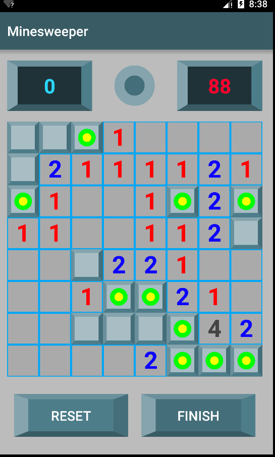
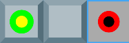

# Minesweeper
First published to the **[Play Store](https://play.google.com/store/apps/details?id=com.orangemako.minesweeper)** on September 15, 2015.

* **Instructions**
    * **Long Click** - Remove tile and uncover square to display number of adjacent squares with mines.
    * **Normal Click** - Add or remove flag.
    * Click **Finish** to stop the timer and calculate results.
    * Click **Reset** to start a new game.

## Implementation Details
All source code has been written exclusively for this application.

### Primary components
* `GameManager` - **[(source)](https://github.com/kgleong/minesweeper/blob/master/app/src/main/java/com/orangemako/minesweeper/game/GameManager.java)**
    * Glue layer between activity, game, and views.
    * Allows the activity to listen for game state events (e.g., win/loss events, mine flag placement events, etc.)
    * Resets the `Game` object and `BoardLayoutView` when the user starts a new game.
* `Game` - **[(source)](https://github.com/kgleong/minesweeper/blob/master/app/src/main/java/com/orangemako/minesweeper/game/Game.java)**
    * Holds game state.
        * Has knowledge of mine placement, adjacent mines count for each square on the board.
        * Also holds references to all `TileView` objects on the board.
    * Checks all user actions to determine if the action is allowed.
        * Publishes win and loss events to the `GameManager`.
        * Triggers view changes based on game state.
        * Views post actions to the event bus, and the `Game` object is responsible for updating the game state and responding to those actions accordingly.
    * Uses Breadth First Search to uncover adjacent blank squares.
* `Board` - **[(source)](https://github.com/kgleong/minesweeper/blob/master/app/src/main/java/com/orangemako/minesweeper/board/Board.java)**
    * Randomly places mines within the board grid.
    * Calculates adjacent mine count for each square on the grid.

### Graphics / UI
This application utilizes custom `View` and `Drawable` objects.  No static `BitmapDrawable` objects are used.  All `Drawable` objects are programmatically created to allow for ease of customization.

The above graphic includes the following graphical components: `TileView`, `ConcentricCirclesDrawable`, and `BeveledTileDrawable`.

* **Custom Views**
    * `BoardLayoutView` - **[(source)](https://github.com/kgleong/minesweeper/blob/master/app/src/main/java/com/orangemako/minesweeper/board/BoardLayoutView.java)**
        * Used to draw the underlying game board and layout tiles.
        * Custom `ViewGroup` that supports custom XML view attributes.
    * `TileView` - **[(source)](https://github.com/kgleong/minesweeper/blob/master/app/src/main/java/com/orangemako/minesweeper/board/TileView.java)**
        * Uses a `LayerListDrawable` that switches the graphic displayed for each independent tile based on three states: `COVERED`, `FLAGGED_AS_MINE`, and `UNCOVERED`.
        * Click listeners:
            * **Long click**: Attempts to uncover a tile to display the tile's adjacent mine count.
            * **Click**: toggles the mine flag for the tile.
* **Drawables**
    * `BeveledTileDrawable` - **[(source)](https://github.com/kgleong/minesweeper/blob/master/app/src/main/java/com/orangemako/minesweeper/drawable/BeveledTileDrawable.java)**
        * Used for game tiles, buttons, and text views.
        * `BeveledTileButton` and `BeveledTileTextView` both support custom XML view attributes that allow customization of colors.
    * `ConcentricCirclesDrawable` - **[(source)](https://github.com/kgleong/minesweeper/blob/master/app/src/main/java/com/orangemako/minesweeper/drawable/ConcentricCirclesDrawable.java)**
        * Used for mines, mine flags, and status indicator.
    * `TextDrawable` - **[(source)](https://github.com/kgleong/minesweeper/blob/master/app/src/main/java/com/orangemako/minesweeper/drawable/TextDrawable.java)**
        * Used to provide adjacent mine count.  Necessary since each tile uses a `LevelListDrawable`.

### Upcoming features
* Add `GameState` parcelable object.
* Support screen orientation.
* Persist game state to SQLite.
* Add high score tracking.
* Add online high score tracking.
* Add navigation drawer.
* Allow user to change grid size.
* Increase test coverage.

### Libraries used:

* **[Otto](http://square.github.io/otto/)** - Event bus to decouple objects.  All event publishing is done to a central `Game` object.
* **[ButterKnife](http://jakewharton.github.io/butterknife)** - Concise view lookup.
